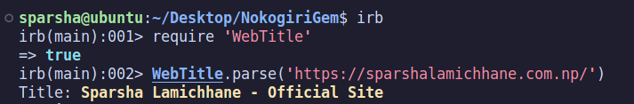

# WebTitle Gem v1.0.0


## Installation
```
gem install WebTitle
```
## Usage
Simply drop in `WebTitle` to a file:

```ruby
require 'WebTitle'
```
```ruby
WebTitle.parse('Your URL')
```
## Ruby Gems
Also you can find this gem here https://rubygems.org/gems/WebTitle